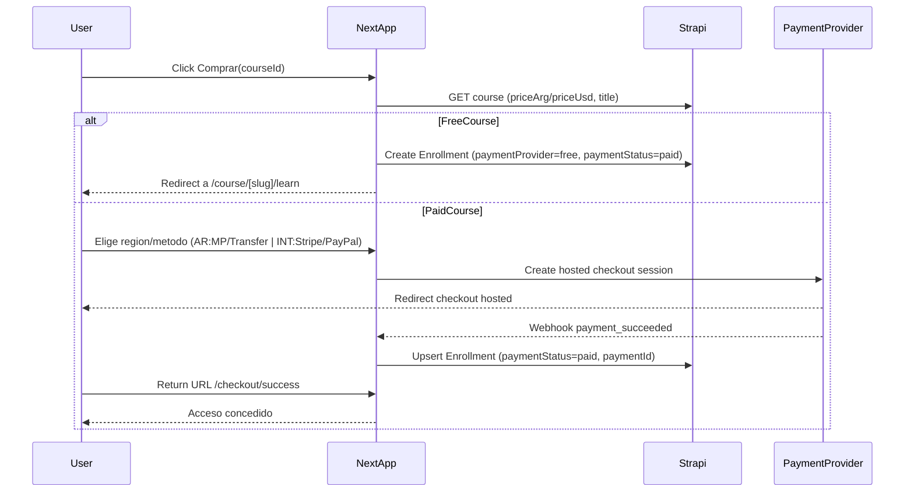

# Checkout simple (compra por curso, sin carrito)

## Objetivo

Implementar un flujo **mínimo y mantenible** para comprar **cursos individuales** (sin carrito) con:

- **Argentina**: MercadoPago (automático) + transferencias (manual)
- **Internacional**: Stripe (automático) + PayPal (fase 2 u opcional)
- **Contenido gratis**: acceso inmediato (sin pago)
- **Precio siempre desde Strapi** (`priceArg`, `priceUsd`)

## Decisión: ¿carrito o compra por curso?

- **Recomendación**: **sin carrito** ahora.
  - Reduce estados, edge cases (sumas, cupones, impuestos, prorrateos), y simplifica la relación con Strapi: una compra acredita **un** `Enrollment`.
  - Encaja con el modelo actual (enrollments ya existen) y con checkout hosted.
- **Evolución futura**: carrito/bundles cuando exista necesidad real (packs, membresías, upsells).

## Arquitectura propuesta (mínima)

### Entidades / estado

- **Strapi `Course`**: ya tiene `priceArg` y `priceUsd` (según `docs/API_REFERENCE.md`).
- **Strapi `Enrollment`**: ya contempla `paymentProvider`, `paymentId` y `expiresAt`.
- **Cambio recomendado (mínimo) en Strapi**: agregar un campo `paymentStatus` (enum: `pending`, `paid`, `failed`, `refunded`) o equivalente.
  - Motivo: las transferencias y pagos fallidos necesitan un estado explícito (hoy `enrollmentStatus` es de progreso, no de pago).

### Flujo de compra (hosted checkout)

- UI existente: [`src/app/(auth)/checkout/page.tsx`](src/app/\\(auth)/checkout/page.tsx) hoy es estática y debe volverse “por curso”.
- Se implementa **un CTA “Comprar” por curso** en el detalle del curso (`/course/[slug]`) que envía a `/checkout?courseId=...`.

## Implementación por etapas (simple y segura)

### Etapa 1 — Stripe internacional (MVP sólido)

- **Next.js API route**: crear endpoint en App Router para crear sesión de Stripe Checkout.
  - Ej: `POST /api/payments/stripe/create-checkout-session`.
- **Webhook**: `POST /api/payments/stripe/webhook`.
  - Verifica firma.
  - Lee `courseId`, `userId` (en `metadata`).
  - Crea/actualiza `Enrollment` en Strapi con `paymentProvider=stripe`, `paymentId`, `paymentStatus=paid`.
- **Front**:
  - En `/checkout`: mostrar resumen (curso + moneda) y botón “Pagar con Stripe”.
  - Redirección a Stripe Checkout.

### Etapa 2 — MercadoPago Argentina (Checkout Pro)

- **Preferencia MercadoPago** (Checkout Pro hosted) desde Next API:
  - `POST /api/payments/mercadopago/create-preference`.
- **Webhook/IPN** MercadoPago:
  - `POST /api/payments/mercadopago/webhook`.
  - Al confirmar `approved`, upsert de `Enrollment`.
- **Front**:
  - En `/checkout`, opción “MercadoPago (Argentina)” con precio en ARS.

### Etapa 3 — Transferencia bancaria (manual)

- En `/checkout`, opción “Transferencia bancaria”:
  - Crea `Enrollment` con `paymentProvider=bank_transfer`, `paymentStatus=pending`.
  - Muestra instrucciones (CBU/alias, referencia, email/whatsapp).
- **Backoffice**:
  - Opción rápida: aprobar manualmente desde Strapi (cambiar `paymentStatus` a `paid`).

### Etapa 4 (opcional) — PayPal internacional

- Recomendación **fase 2** porque la integración “hosted” moderna suele requerir más plumbing.
- Alternativa si se prioriza rapidez:
  - **PayPal Payment Links**/botón externo (menos integración) + acreditación manual al inicio.

## Integraciones “fáciles” / 3rd party

- **Más fácil y robusto (recomendado)**: 
  - **Stripe Checkout** (hosted) + webhooks.
  - **MercadoPago Checkout Pro** (hosted) + webhooks.
- **Agregadores tipo dLocal/PayU**: pueden unificar métodos, pero suelen introducir contratos/fees y complejidad; no es “plugin gratis” y normalmente no reduce trabajo en un MVP.
- **Plugins “todo-en-uno”**: en Next.js/Strapi rara vez resuelven a la vez MP + Stripe + PayPal con control de enrollments; normalmente igual necesitás webhooks y lógica de acceso.

## UX y buenas prácticas (lo mínimo que conviene)

- **Compra por curso**: CTA claro (“Comprar acceso”) y “Ya tenés acceso” si existe enrollment.
- **Detección región**: default por idioma/geo, pero siempre permitir cambiar (Argentina/Internacional).
- **Precio**:
  - Mostrar ARS para Argentina y USD para internacional (desde Strapi). 
  - Si `priceArg` o `priceUsd` es 0 → tratar como gratis.
- **Estados**:
  - Pantalla “Procesando pago…” al volver del proveedor.
  - Página de éxito que valida acceso consultando Strapi/Mercadopago.
  - Página de error con reintento y soporte.
- **Seguridad**:
  - Nunca confiar en el “success redirect” para otorgar acceso; solo webhook.
  - Verificación de firmas de webhook.
- **Recibos y soporte**: email post-pago (fase 2), política de reembolsos visible.

## Archivos donde se tocaría (orientativo)

- UI checkout: [`src/app/(auth)/checkout/page.tsx`](src/app/\\(auth)/checkout/page.tsx)
- API routes nuevos en Next: `src/app/api/payments/*/route.ts`
- Cliente Strapi/Helpers: [`src/lib/api.ts`](src/lib/api.ts) y/o [`src/lib/strapi.ts`](src/lib/strapi.ts)
- Tipos: `src/types/enrollment.ts`, `src/types/course.ts`

## Todos

- `decide-single-course-checkout`: Confirmar compra por curso (sin carrito) y reglas de “gratis”.
- `stripe-checkout-webhook`: Implementar Stripe Checkout + webhook y alta de `Enrollment`.
- `mercadopago-checkout-webhook`: Implementar MercadoPago Checkout Pro + webhook y alta de `Enrollment`.
- `bank-transfer-pending`: Implementar transferencia con `paymentStatus=pending` + instrucciones.
- `checkout-ux-states`: Estados de loading/success/error + validación de acceso contra Strapi.